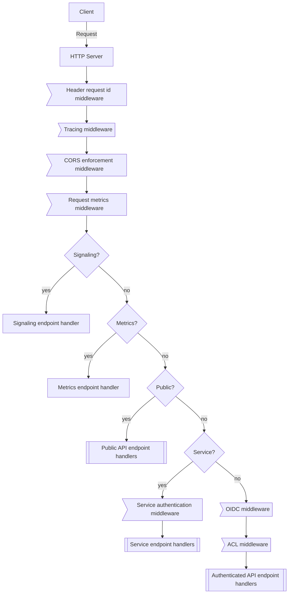

# Handling of WebAPI HTTP requests

Requests to the WebAPI are handled by the web server which is embedded in the
OpenTalk controller. Each request is passed through some layers of middleware
before they reach the handler that processes and answers it.

## Details

### HTTP server

The HTTP server receives the requests from the client and passes it on to the
middlewares and endpoints.

### Header request id middleware

This middleware adds a unique id to the request so that it can be tracked
throughout the system. If the same header was already sent from the client, it
will not be modified.

### Tracing middleware

The [tracing logger](https://docs.rs/tracing-actix-web/latest/tracing_actix_web/struct.TracingLogger.html)
middleware captures structured request and response information and passes it on
to the configured tracing subscriber. It does not apply any modifications to
the request.

### CORS enforcement middleware

This middleware refuses or allows requests based on the CORS policy of the web
service. It does not apply any modifications to the request.

### Request metrics middleware

This middleware records the handler duration for each request handler
categorized by the HTTP response status. It does not apply any modifications to
the request.

### Signaling endpoint handler

Handles the requests to the WebSocket signaling endpoint which is responsible
for processing the communication between clients and the controller during
a meeting. The documentation of the protocol can be found in the
[Signaling section of the developer documentation](https://docs.opentalk.eu/developer/controller/signaling/).

### Metrics endpoint handler

Endpoint to fetch collected metrics from the controller. The documentation can
be found in the [metrics section](../core/logging/metrics.md#web-api).

Depending on the corresponding configuration the endpoint handler itself will
either return the contents or deny the request with the corresponding HTTP
status code.

### Public API endpoint handlers

These are API endpoints that are available to the public without authentication.
They provide general information that the client needs to fetch upfront before
logging in.

The endpoints are described in the
[OpenAPI specification](https://docs.opentalk.eu/developer/controller/rest/).

### Service auth middleware

Authenticates [services](#service-endpoint-handlers) using the claims provided
in the OIDC access token.

### Service endpoint handlers

These endpoints are for services that log in to meetings for providing
functionality for the meeting, such as the
[OpenTalk Recorder](https://docs.opentalk.eu/admin/recorder/) or the
[OpenTalk Obelisk](https://docs.opentalk.eu/admin/obelisk/).

### OIDC middleware

This middleware verifies that the OIDC JSON Web Token provided by the client is
valid and contains the required information. It extracts information such as
the user id and adds it to the request for the subsequent middlewares or request
handlers.

In addition, it can authenticate through an invite code header for guest
participants when no OIDC token is provided.

### ACL middleware

The ACL middleware enforces access rules to the authenticated endpoints. The
rules are stored in the
[`casbin_rule` database table](https://docs.opentalk.eu/developer/controller/database/).
This is enforced by the
[Casbin rule enforcement engine](https://docs.rs/casbin/), which is the base for
the OpenTalk Controller rule enforcement system called `kustos`. When an
endpoint is not allowed for access, the corresponding HTTP error status code
is returned.

### Authenticated API endpoint handlers

These are API endpoints that are only available after authentication.

The endpoints are described in the
[OpenAPI specification](https://docs.opentalk.eu/developer/controller/rest/).
