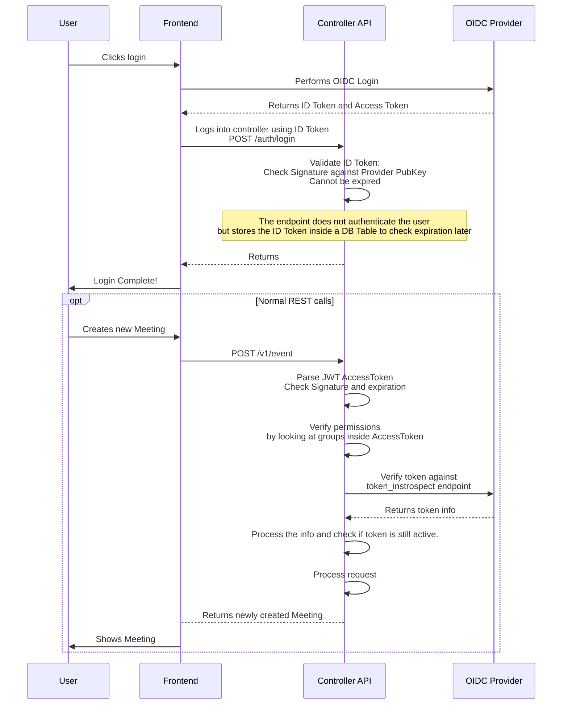

# OIDC Authentication Flow for OpenTalk Controller WebAPI endpoints

This diagram describes the flow of an authentication against the OIDC provider
for accessing the
[OpenTalk Controller WebAPI](https://docs.opentalk.eu/developer/controller/rest/).

