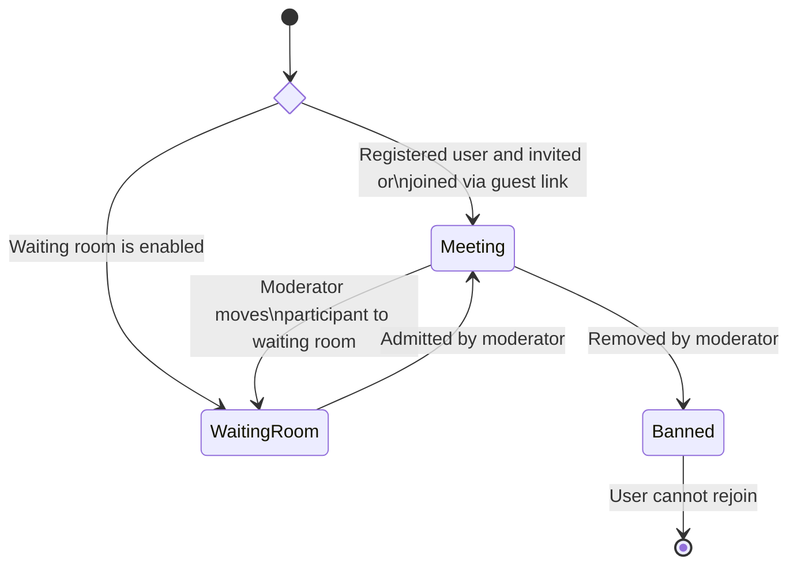

# Participant Lifecycle and States

This document outlines the different states a participant can have and how they
can transition between these states within a meeting.

## Waiting Room

When the waiting room is enabled, both registered users and guests are directed
to it before they can enter the meeting. Participants can only join the meeting
once they have been admitted by a moderator.

Moderators also have the ability to move participants from an ongoing meeting
back to the waiting room at any time.

## Meeting

Participants, whether users or guests, can only join a meeting if they are invited.
Guests can access the meeting through a guest link, which has no usage limits,
can be reused multiple times and simultaneously by multiple clients. If a guest
is banned during a meeting, they can still use the guest link to attempt to rejoin.

:::info Guest Rejoining After Being Banned

Because there's no foolproof and privacy-respecting method to identify guests,
they may still reenter a meeting using the guest link even after being banned.

To prevent banned guests from rejoining, enabling the waiting room is an effective
solution.

:::

## Banned

When a participant (user or guest) is banned from a meeting, they are blocked
from re-entering until the current meeting session ends (i.e., all participants
leave). In the case of recurring meetings, banned users can join future sessions
unless further action is taken.

To prevent a user from joining future meetings, their invitation must be revoked
by removing them from the event. This action can be performed through the dashboard.
