# Entity-relationship model

The following shows the entity-relationship model of the Postgres database used
by the opentalk controller.

```mermaid
erDiagram
assets {
    uuid id PK
    uuid tenant_id FK
    timestamp_with_time_zone created_at
    character_varying filename
    character_varying kind
    character_varying namespace
    bigint size
    timestamp_with_time_zone updated_at
}
casbin_rule {
    integer id PK
    character_varying ptype
    character_varying v0
    character_varying v1
    character_varying v2
    character_varying v3
    character_varying v4
    character_varying v5
}
event_email_invites {
    character_varying email PK
    uuid event_id PK,FK
    uuid created_by FK
    timestamp_with_time_zone created_at
    email_invite_role role
}
event_exceptions {
    uuid id PK
    uuid created_by FK
    uuid event_id FK
    timestamp_with_time_zone created_at
    character_varying description
    timestamp_with_time_zone ends_at
    character_varying ends_at_tz
    timestamp_with_time_zone exception_date
    character_varying exception_date_tz
    boolean is_all_day
    event_exception_kind kind
    timestamp_with_time_zone starts_at
    character_varying starts_at_tz
    character_varying title
}
event_favorites {
    uuid event_id PK,FK
    uuid user_id PK,FK
}
event_invites {
    uuid id PK
    uuid created_by FK
    uuid event_id FK
    uuid invitee FK
    timestamp_with_time_zone created_at
    invite_role role
    event_invite_status status
}
event_shared_folders {
    uuid event_id PK,FK
    timestamp_with_time_zone created_at
    text path
    text read_password
    text read_share_id
    text read_url
    timestamp_with_time_zone updated_at
    text write_password
    text write_share_id
    text write_url
}
event_training_participation_report_parameter_sets {
    uuid event_id PK,FK
    bigint checkpoint_interval_after
    bigint checkpoint_interval_within
    bigint initial_checkpoint_delay_after
    bigint initial_checkpoint_delay_within
}
events {
    uuid id PK
    uuid created_by FK
    uuid room FK
    uuid tenant_id FK
    uuid updated_by FK
    timestamp_with_time_zone created_at
    character_varying description
    integer duration_secs
    timestamp_with_time_zone ends_at
    character_varying ends_at_tz
    bigint id_serial
    boolean is_adhoc
    boolean is_all_day
    boolean is_recurring
    boolean is_time_independent
    character_varying recurrence_pattern
    integer revision
    boolean show_meeting_details
    timestamp_with_time_zone starts_at
    character_varying starts_at_tz
    character_varying title
    timestamp_with_time_zone updated_at
}
external_tariffs {
    text external_id PK
    uuid tariff_id FK
}
groups {
    uuid id PK
    uuid tenant_id FK
    bigint id_serial
    text name
}
invites {
    uuid id PK
    uuid created_by FK
    uuid room FK
    uuid updated_by FK
    boolean active
    timestamp_with_time_zone created_at
    timestamp_with_time_zone expiration
    bigint id_serial
    timestamp_with_time_zone updated_at
}
job_execution_logs {
    bigint id PK
    bigint execution_id FK
    log_level log_level
    text log_message
    timestamp_with_time_zone logged_at
}
job_executions {
    bigint id PK
    bigint job_id FK
    timestamp_with_time_zone ended_at
    job_status job_status
    timestamp_with_time_zone started_at
}
jobs {
    bigint id PK
    job_type kind
    text name
    jsonb parameters
    text recurrence
    integer timeout_secs
}
module_resources {
    uuid id PK
    uuid created_by FK
    uuid room_id FK
    uuid tenant_id FK
    timestamp_with_time_zone created_at
    jsonb data
    character_varying namespace
    character_varying tag
    timestamp_with_time_zone updated_at
}
refinery_schema_history {
    integer version PK
    character_varying applied_on
    character_varying checksum
    character_varying name
}
room_assets {
    uuid asset_id PK,FK
    uuid room_id PK,FK
}
room_streaming_targets {
    uuid id PK
    uuid room_id FK
    streaming_kind kind
    text name
    text public_url
    text streaming_endpoint
    text streaming_key
}
rooms {
    uuid id PK
    uuid created_by FK
    uuid tenant_id FK
    timestamp_with_time_zone created_at
    boolean e2e_encryption
    bigint id_serial
    character_varying password
    boolean waiting_room
}
sip_configs {
    bigint id PK
    uuid room FK
    boolean enable_lobby
    character_varying password
    character_varying sip_id
}
tariffs {
    uuid id PK
    timestamp_with_time_zone created_at
    text[] disabled_features
    text[] disabled_modules
    text name
    jsonb quotas
    timestamp_with_time_zone updated_at
}
tenants {
    uuid id PK
    timestamp_with_time_zone created_at
    text oidc_tenant_id
    timestamp_with_time_zone updated_at
}
user_groups {
    uuid group_id PK,FK
    uuid user_id PK,FK
}
users {
    uuid id PK
    uuid tariff_id FK
    uuid tenant_id FK
    character_varying avatar_url
    character_varying conference_theme
    character_varying dashboard_theme
    timestamp_with_time_zone disabled_since
    character_varying display_name
    character_varying email
    character_varying firstname
    bigint id_serial
    bigint id_token_exp
    character_varying language
    character_varying lastname
    character_varying oidc_sub
    character_varying phone
    tariff_status tariff_status
    character_varying title
}


assets }o--|| tenants: ""
event_email_invites }o--|| events: ""
event_email_invites }o--|| users: ""
event_exceptions }o--|| events: ""
event_exceptions }o--|| users: ""
event_favorites }o--|| users: ""
event_favorites }o--|| events: ""
event_invites }o--|| events: ""
event_invites }o--|| users: ""
event_invites }o--|| users: ""
event_shared_folders |o--|| events: ""
event_training_participation_report_parameter_sets |o--|| events: ""
events }o--|| rooms: ""
events }o--|| users: ""
events }o--|| users: ""
events }o--|| tenants: ""
external_tariffs }o--|| tariffs: ""
groups }o--|| tenants: ""
invites }o--|| users: ""
invites }o--|| users: ""
invites }o--|| rooms: ""
job_execution_logs }o--|| job_executions: ""
job_executions }o--|| jobs: ""
module_resources }o--|| tenants: ""
module_resources }o--|| rooms: ""
module_resources }o--|| users: ""
room_assets }o--|| rooms: ""
room_assets }o--|| assets: ""
room_streaming_targets }o--|| rooms: ""
rooms }o--|| users: ""
rooms }o--|| tenants: ""
sip_configs }o--|| rooms: ""
user_groups }o--|| users: ""
user_groups }o--|| groups: ""
users }o--|| tenants: ""
users }o--|| tariffs: ""


```

<!-- begin:fromfile:database/er-diagram.md -->

<!-- end:fromfile:database/er-diagram.md -->
